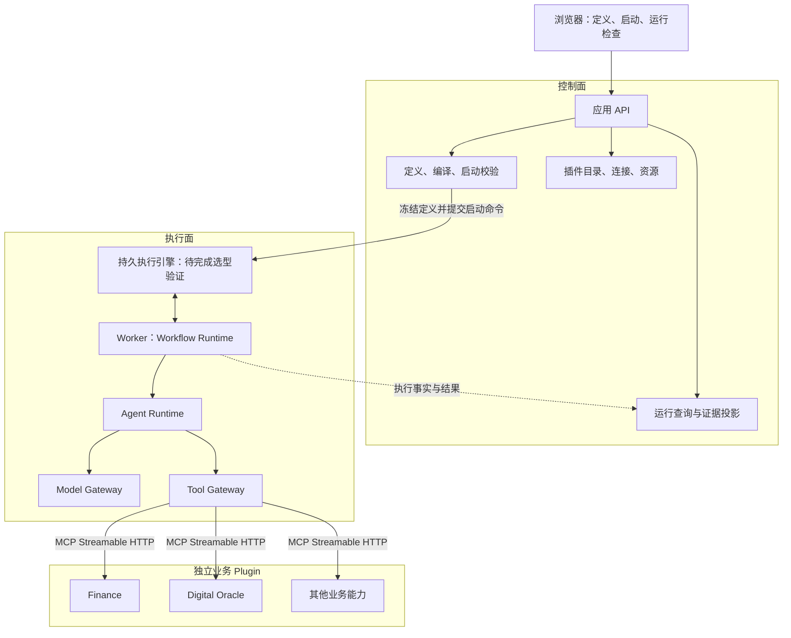
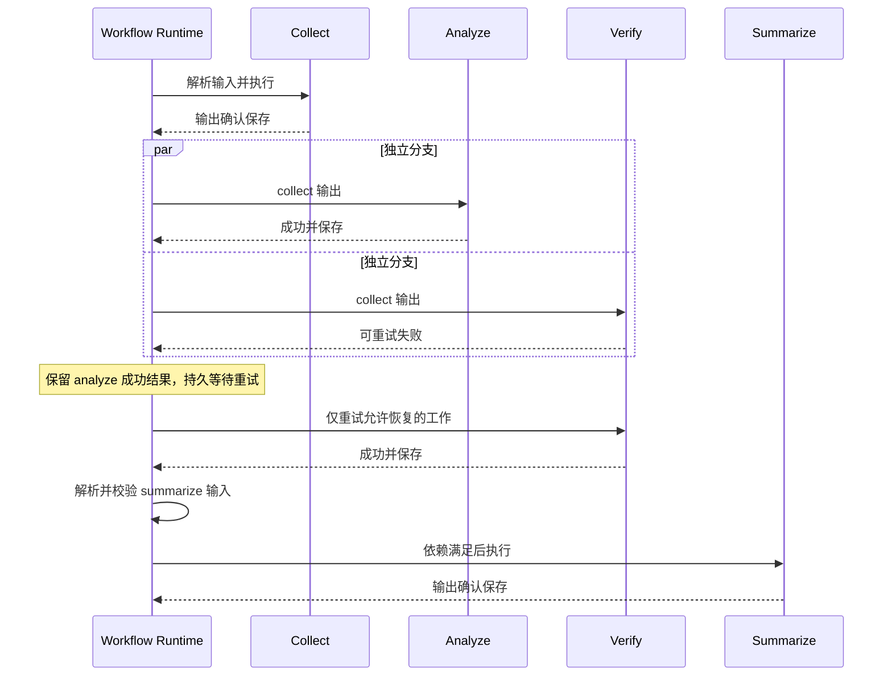

# 迭代目标

本文件定义 SignalDeck 后续迭代的目标架构与可观察验收，是目标内容的唯一权威。依据是引用任务[设计 Agent 平台理想架构](thread://01a07d7d-98fe-7c30-878a-7c8bec093ce9?hostId=local) 的最终结论，并采用该任务最后一次答复对依赖推导、执行引擎候选和缓存语义的修正。

这些内容构成目标基线 `SD-TARGET-001`，是已接受的迭代方向，不表示当前实现已具备相应能力。当前交付能力见[产品说明](产品说明.md)，当前实现见[架构说明](架构说明.md)；文档包的冻结引用方式及适用边界见[项目状态](../STATUS.md)。本文件描述理想终态，不设计旧实现的迁移或兼容路径。

目标编号 `T01`—`T08` 和验收编号 `A01`—`A18` 用于后续任务与证据引用。技术候选和待验证事项属于目标的一部分，不得把候选首选或尚未完成的集成验证改写为已定案、已实现或已通过。

## T01：个人工作流平台与部署边界

SignalDeck 的目标是以声明式 DAG 为中心、以 Agent 为业务执行单元、以独立 Plugin 提供业务能力、由一个持久执行引擎统一驱动的个人工作流平台。操作者能够配置定义和资源、手动或定时启动工作流，并检查运行图、调用证据和产物。

核心代码采用模块化单体，部署分为 API 与 Worker 两种进程角色；业务 Plugin 具有独立进程、部署和升级生命周期。持久执行基础设施是独立基础设施边界，不要求每个核心模块都部署为服务。



控制面负责定义、允许使用的资源和已发生事件的查询；执行面负责运行、等待、重试、取消和恢复。API 提交启动命令后返回，不承担长任务，浏览器关闭不影响执行。选定的持久执行引擎是执行生命周期的唯一权威；平台数据库的查询投影不得形成另一套领取、重试和恢复调度器。

核心不导入 Plugin 的业务代码。Finance 的模板、报告、市场数据模型、业务持久化和业务页面归 Finance；未启用插件的配置或启动故障不得阻止通用 API 和无关 Agent 工作。独立插件接入属于目标范围，插件市场、多租户和公共认证产品不因该边界而进入范围。

## T02：模块、领域对象与状态所有权

模块按责任和状态所有权划分，不围绕一个掌握所有业务的 Agent Core 类组织。

| 模块 | 责任 | 所有权 |
| --- | --- | --- |
| Definition | 管理 Package、Workflow、Agent 的定义和修订 | 不可变定义、引用关系 |
| Compiler | 检查合并 DAG、输入输出映射、类型和资源引用 | 确定性的执行计划 |
| Launch | 校验输入、解析依赖、冻结运行并提交命令 | Run 身份、启动来源、运行快照 |
| Workflow Runtime | 判断就绪、并行、汇聚、节点失败和取消 | 当前 Run 的 DAG 控制状态；由持久执行引擎持久化驱动 |
| Agent Runtime | 构建上下文、执行模型或确定性策略、校验结果 | 当前 invocation 的隔离执行状态 |
| Model Gateway | 根据冻结的模型配置执行模型请求 | 模型调用边界及其执行证据 |
| Tool Gateway | 授权、参数校验、分发、输出校验、重试约束 | Tool operation、各次尝试与调用证据 |
| Plugin Catalog | 管理安装记录、发布身份、目录、绑定和健康信息 | 插件描述、连接绑定 |
| Connections / Resources | 管理模型连接、凭据与资源作用域 | 配置与受控资源引用 |
| Evidence / Artifacts | 保存输入输出、调用记录、产物并构建读取投影 | 运行证据、通用产物及其元数据 |

静态对象包括 `PackageRevision`、`WorkflowDefinition`、`AgentDefinition`、`NodeDefinition`、`PluginRelease` 和 `ToolDefinition`。运行对象包括 `ResolvedRunSpec`、`WorkflowRun`、`NodeExecution`、`AgentAttempt`、`ModelCall`、`ToolOperation`、`ToolAttempt` 和 `ArtifactRef`。这些名称表达领域责任，不预先规定数据库表或公共 API schema。

`AgentDefinition` 描述任务、输入输出、模型策略、工具选择和预算；`NodeDefinition` 描述该 Agent 在 Workflow 中的位置、依赖、条件和输入映射；`AgentAttempt` 表示一次实际执行。同一个 Agent 可用于多个节点或 Workflow，改变图中依赖不需要修改 Agent 定义。

Workflow Package 是完整、可校验的运行包，包含或解析固定的 Agent 定义及相关契约。界面编辑与 YAML 编辑操作同一份定义，不能各自维护一套执行真相。

运行控制状态归执行面，模板和报告等业务状态归 Plugin，连接池和客户端归进程生命周期。Agent 不保留隐式的跨次运行会话，但其输入、模型调用、工具调用和结果须形成持久证据。Agent 无状态不表示纯函数：模型输出、外部数据和业务效果可能变化；承诺是输入显式、执行隔离、输出可验证、过程可追踪。

## T03：启动链、调用边界与 Agent 执行策略

启动链统一承接手动和定时触发：

```text
Browser / Scheduled Trigger
  → Launch Application Service
  → Validate + Resolve Dependencies
  → Freeze ResolvedRunSpec
  → Atomically Persist Run + Snapshot + Start Command
  → Deliver Start Command to Durable Execution Engine
```

Run、快照和启动命令通过同一数据库事务保存，事务 outbox 以稳定 Run ID 幂等投递。数据库提交与引擎启动之间发生中断时，命令能够继续投递，不能遗留永远未启动的 Run 或重复创建逻辑运行。

执行链保留统一 Agent 边界：

```text
Workflow Runtime
  → Resolve and Validate Node Input
  → AgentInvocation
      → Build Invocation Context
      → Execute Model Strategy or Deterministic Strategy
      → Tool Gateway
          → Check Grant + Validate Input
          → Resolve Frozen Plugin Binding
          → Send MCP Request
          → Plugin Handler → External System / Plugin Store
          → Validate Tool Output + Record Evidence
      → Continue Bounded Model Loop when Required
      → Validate Agent Output
  → Commit Immutable Node Result
  → Release Newly Ready Nodes
```

这是逻辑调用关系；引擎调度和 MCP 请求跨越进程，不构成贯穿所有组件的同步调用栈。Workflow 使用的契约为 `execute(AgentDefinition, Input, InvocationContext) → AgentResult`，只依赖 Agent 的输入输出和执行结果，不依赖内部模型轮数或工具提供方。

Agent 是最小业务执行单元，不要求每次都调用 LLM。模型策略通过推理选择工具；确定性策略按定义直接调用指定工具并转换结果，使固定查询、报告保存等操作无需增加无意义的模型调用。输入拼装、条件判断和依赖计算归 Workflow Runtime。

Agent 之间通过 Workflow 的显式数据流协作。目标不开放递归 `Agent → Agent → Agent` 调用；Agent 内部模型循环须受模型轮数、工具次数、总时限和预算限制。Workflow 节点并行、单个 Agent 工具并行和外部服务限流分别配置，节点分支不要求模型支持并行 Tool Calling。

## T04：DAG、数据流、时序与恢复语义

### T04.1：合并依赖图

实际调度依赖由三类边合并产生：

```text
实际调度依赖
  = dependsOn 中的额外控制依赖
  ∪ inputMapping 引用的节点
  ∪ 条件表达式引用的节点
```

操作者无需在 `dependsOn` 重复声明数据或条件已经表达的依赖。Compiler 对合并后的图检查未知引用、类型及环，包括只通过数据或条件引用形成的环；编辑器显示推导出的边及其来源，启动依据同一份已编译图。

以下是目标语义示意，不是当前可导入的 YAML 格式：

```text
collect.inputMapping.topic = workflow.input.topic
analyze.inputMapping.evidence = nodes.collect.output
verify.inputMapping.evidence = nodes.collect.output
summarize.inputMapping.analysis = nodes.analyze.output
summarize.inputMapping.verification = nodes.verify.output
summarize.inputMapping.sources = nodes.collect.output.sources
workflow.output.summary = nodes.summarize.output
```

这里自动推导出 `collect → analyze`、`collect → verify`、`analyze → summarize`、`verify → summarize` 和 `collect → summarize`。只有“须先完成但不读取其结果”的额外控制关系才需要 `dependsOn`。

映射支持引用、常量、对象和数组组合，以及显式缺失值处理；不允许任意 Python、JavaScript 或网络访问。Workflow 最终输出采用同一映射能力。输入解析后、Agent 输出提交前和工具调用边界分别执行对应契约校验。

### T04.2：就绪、并行与终态

节点满足自身依赖后立即进入就绪集合，不使用整层全局屏障，无关慢分支不能阻塞已就绪节点。



| 场景 | 必需语义 |
| --- | --- |
| 必需依赖成功 | 节点进入就绪集合 |
| 必需依赖失败 | 下游标记依赖阻断；独立分支按明确失败策略处理 |
| 条件为假 | 节点为 `skipped`，不产生虚构输出 |
| 汇聚允许跳过或失败分支 | 显式声明接受的上游状态，并处理缺失输出 |
| Worker 中断 | 从持久记录恢复，复用该 Run 内已确认成功的调用结果 |
| 取消请求 | 停止新调度、传播取消，区分请求已接受与工作实际停止 |
| deadline 到期 | 终止继续调度和允许的等待；重试不得重置总时限 |
| 整次 rerun | 新建 Run 并保留来源关系，适用新 Run 的执行与缓存语义 |

### T04.3：调用级恢复与结果未知

模型请求和工具操作须具有比整个 Agent 更细的持久恢复边界。不得仅将多轮 Agent 包成一个无法检查内部完成记录的任务，然后声称具备调用级恢复。

工具重试与节点重试分别建模。暂时性工具失败优先恢复同一工具操作；重启整个 Agent 可能产生不同模型决策，必须依据 effect、已有操作证据和重试约束判断是否允许。

有副作用的调用在发出前获得持久化 `operationId`。同一逻辑操作重试复用该身份，每次网络尝试保留独立 `ToolAttempt`。请求超时或响应丢失时，若不能确认是否已产生效果，状态为结果未知 `unknown`，不能直接按未发生处理。先通过插件查询或去重机制核实；无法核实时保留未知状态与原因，禁止盲目重复写入。

持久执行引擎不替外部系统承诺 exactly-once。取消和超时不撤销已经产生的效果。已确认成功的调用与“外部可能完成但平台尚未确认”的调用必须区分，证据应能解释恢复时为何复用、重试、等待核实或停止。

### T04.4：恢复、重新运行与缓存

| 作用域 | 目标语义 |
| --- | --- |
| 同一 Run 故障恢复 | 使用该 Run 已确认的模型和工具结果，避免重复完成工作 |
| 新 Run / rerun / 新的定时触发 | 创建新的执行身份，默认重新调用模型、获取当前数据 |
| 跨 Run 缓存 | 仅在显式缓存策略允许时复用，声明适用操作、键、作用域、有效期和数据新鲜度 |

市场数据查询和定时研究不能因 SDK 默认缓存键省略运行身份而静默复用旧结果。采用缓存时，运行证据须可辨认数据来源、结果取得时间和缓存命中；业务写入的 operation 去重不等同于跨 Run 结果缓存。

## T05：契约、插件接入与不可变运行绑定

### T05.1：模块交换契约

| 边界 | 允许交换 | 不得泄漏 |
| --- | --- | --- |
| Workflow → Agent | 已解析输入、Agent 定义、调用上下文 | Workflow 全部可变状态、其他节点对象 |
| Agent → Tool Gateway | Tool 身份、参数、操作身份 | 插件实例、数据库 Session |
| Tool Gateway → Plugin | 契约化请求、必要资源授权、deadline | 宿主 repository、全部凭据、全局配置 |
| Plugin → Core | 结构化结果、错误、产物引用 | ORM 对象、插件私有运行对象 |
| 执行面 → 查询面 | 有稳定身份的事件和结果 | 可反向修改调度状态的共享对象 |

`InvocationContext` 只携带 `runId`、`nodeId`、`invocationId`、deadline、预算分配、工具授权引用、资源引用和 trace context 等必要执行信息。业务输入与执行上下文分开。凭据值在实际 I/O 边界按需解析，不进入模型消息、运行快照、持久执行引擎 payload、浏览器响应或诊断。

### T05.2：Tool 与 Plugin 身份

`ToolDefinition` 至少包含 `toolId`、`ownerPluginId`、输入输出 schema、effect 分类、资源要求、超时和重试约束。工具目录、模型工具声明和实际分发必须由同一份契约派生。

Plugin 发布描述包括身份、制品摘要、配置 schema、工具契约摘要、调用端点和可选业务页面入口。MCP 负责能力调用；SignalDeck 的插件契约负责安装记录、发布身份、Agent 接入和资源约束。Agent 侧 Toolset 只是工具集合适配，不能代替插件独立部署。

Agent 有效工具集合为：

```text
已安装且可用的插件工具
∩ Agent 选择的插件和工具
∩ 当前 Run 允许的资源作用域
```

全局工具身份使用 `publisher/plugin/tool` 一类限定标识。不同插件可拥有同名 `search`；模型函数名仅为本次运行的别名，通过冻结映射解析到真正 Tool ID，不能依赖未限定名称分发。

### T05.3：冻结内容和数据所有权

创建 Run 时固定 Package、Workflow、Agent、执行计划、插件制品、工具输入输出契约、模型运行配置、工具授权、非敏感资源绑定，以及核心执行制品身份。新定义或新插件发布不改变既有 Run 的绑定；找不到绑定制品时明确失败，不静默改用最新版。

冻结定义保证可以识别“本次执行什么”，不承诺相同模型答案或相同外部数据。小型 JSON 直接传值，大型内容通过不可变 `ArtifactRef` 引用；产物内容使用内容寻址，成功节点输出提交后不可覆盖。

Plugin 拥有自身业务表和业务页面。即使物理共用 PostgreSQL，也须保持独立数据所有权与访问凭据，不跨模块直读私有表。通用运行历史通过保存的契约化证据读取，不要求初始化对应业务插件。

## T06：确定的技术方向与执行引擎验证

### T06.1：确定的目标方向

| 层次 | 目标方向 |
| --- | --- |
| 后端 | Python；HTTP API 使用 FastAPI + Pydantic |
| Agent Runtime | Pydantic AI；保持统一 Agent 契约及调用级持久恢复能力 |
| 插件传输 | MCP Streamable HTTP；采用明确、统一的协议版本，不随运行漂移 |
| 数据契约 | JSON Schema 2020-12 的明确受限子集；不静默删除模型不支持的约束 |
| 平台存储 | PostgreSQL + SQLAlchemy，保存定义、启动命令、查询投影和产物元数据 |
| 产物存储 | 本地持久卷上的内容寻址存储，大对象不挤入执行历史 |
| 前端 | React + TypeScript + Vite + TanStack Query |
| 可观测性 | OpenTelemetry 与平台运行证据分别承担追踪和产品查询职责 |
| 部署 | Docker Compose 组织 API、Worker、数据库、业务插件和选定执行基础设施 |

具体库版本和协议版本须在实现时按支持情况确认并固定。本文件采用引用结论的选型方向，不把其研究时的“current”版本当作永久最新版本，也不声明整套集成已经通过验证。

Pydantic AI 侧采用稳定的 Tool Gateway / 动态工具集合入口，实际工具集合由冻结的 Run 定义解析。新增插件应由制品和配置进入新运行，不应要求为每个插件向 Worker 注册业务 Python 代码。动态 schema 的解析、别名和并发隔离必须以集成验证证明。

### T06.2：执行引擎尚未定案

Temporal 保留为首选，Prefect 为正式候选，Hatchet 为有竞争力的候选。必须比较三者对同一组验收的实现成本与持续运行复杂度，不能只凭支持 DAG、并行和汇聚就确定最终选择。

| 候选 | 在引用结论中的定位 | 项目集成需要验证的重点 |
| --- | --- | --- |
| Temporal | 首选，尚未完成项目集成验证 | 调用级历史与恢复、确定性约束、取消传播、动态 Tool Gateway、固定制品恢复及运行复杂度 |
| Prefect | 正式候选，不能仅视为原型路线 | 调用级恢复、数据与控制依赖表达、Pydantic AI 集成、缓存作用域与新 Run 数据新鲜度 |
| Hatchet | 正式比较的后台执行候选 | 动态 durable task、检查点与 Agent 内部调用级恢复；Pydantic AI 适配的可用路径和维护成本 |

引用研究未核实到 Pydantic AI 官方现成的 Hatchet 持久执行适配；这是一项证据缺口，不是对其永远不支持的判断。LangGraph 不应因被误认缺少持久恢复而排除，但本目标优先保持独立 Agent 契约，并由选定引擎统一负责完整执行生命周期，不叠加第二套图执行或自建持久队列。

若最终选定 Temporal，以下是需验证的实现方案：一个 SignalDeck Run 对应一个 Temporal Workflow，Agent 节点执行对应 Child Workflow，模型请求或工具调用对应 Activity；Pydantic AI 的 `TemporalDurability` 和稳定动态 Toolset 接入同一执行引擎。该映射、`TemporalDurability` 及 Temporal Schedules 都是候选特定方案，不是所有引擎必须实现的抽象。

定时触发的引擎无关目标是显式时区、重叠策略、错过策略和启动来源；跟踪范围必须覆盖实际 Workflow 生命周期，以正确判断重叠。调度设施的具体选择须随执行引擎定案，不另建竞争的持久状态权威。

集成验证至少覆盖动态 schema、并发 Run 隔离、Agent 内部调用级恢复、取消和总 deadline、固定插件及核心制品后的恢复、outbox 中断与重复投递、同 Run 恢复与跨 Run 缓存区分。验证结果应支持候选比较和最终决策；在这些证据建立前，本目标保留“首选但未定案”的状态。

## T07：设计模式与依赖方向

| 模式 | 明确用途 |
| --- | --- |
| Ports and Adapters | 领域通过小接口使用模型、工具、存储和执行基础设施 |
| Strategy | Agent 模型/确定性策略，以及重试和汇聚策略 |
| Composition | 用任务定义、模型配置、工具集与执行策略组合 Agent |
| Registry | 从完整契约构建目录及分发映射 |
| Dependency Injection | 在 API / Worker 组合根接入实现 |
| State Machine | 校验节点、尝试及工具操作的合法状态转换 |
| Transactional Outbox | 连接平台数据库事务和执行命令可靠投递 |
| 有限 CQRS | 分离执行事实与界面查询投影 |
| Decorator / Middleware | 在工具边界统一附加授权、计量、限流与证据记录 |

依赖方向是 `API / Worker / Plugin Transport → Application Services → Domain + Contracts`。基础设施在组合根接入，Domain 不导入 FastAPI、SQLAlchemy、MCP 客户端或 Finance 业务模块。

Registry 不能成为全局 Service Locator；业务代码通过显式依赖取得能力，不能从万能容器任意索取服务。上述模式以解决已列出的边界和状态问题为限，不要求每个名词都增加独立框架或服务。

## T08：封装、多态与证据结构

封装以状态所有权为界：Workflow 不能读取 Agent 的内部会话，Agent 不能读取其他节点的可变状态，Plugin 不能操作核心数据库对象，公共响应不能直接序列化内部执行对象。

多态通过 `AgentExecutor`、`ToolInvoker` 等小接口表达，Python 可使用 `Protocol` 定义结构化契约。不同实现遵守相同输入输出和错误语义，不需要统一继承业务基类。继承仅用于确实存在的类型专化、异常分类或必要框架适配；不设计 `BaseAgent → ToolAgent → WorkflowAgent → FinanceAgent` 业务继承链，也不提供能访问宿主所有服务的 `BasePlugin`。

调用归属与数据依赖分别建模。证据树表达执行所有权：

```text
WorkflowRun
  └─ NodeExecution
      └─ AgentAttempt
          ├─ ModelCall
          └─ ToolOperation
              └─ ToolAttempt
```

节点间依赖和产物来源构成另一张 DAG。汇聚节点只有一个运行归属，通过引用关联多个上游；trace 可使用 span links 表达额外关联，不能强行将多上游依赖压成调用树。平台运行证据应独立可读，不能要求外部追踪服务可用才能确认执行结果。

## 可观察验收

以下验收验证目标是否实现，不声明当前实现已经通过。后续任务按编号关联实际变更和验证证据；整体目标完成须覆盖全部适用项，不能以一次引擎示例或正常路径运行代替故障与边界验证。

| 编号 | 对应目标 | 验收结果 |
| --- | --- | --- |
| A01 | T01、T05 | 接入第三个非金融插件，仅增加插件制品和配置即可被 Agent 使用；不修改或重新交付核心业务代码；插件可独立部署和升级。 |
| A02 | T01、T05 | 未启用插件配置无效或启动失败时，通用 API、历史读取和无关 Agent 仍可使用；历史读取不初始化该插件。 |
| A03 | T02、T03 | 同一 Agent 定义用于不同节点和 Workflow；修改依赖只修改节点；模型策略与确定性策略均通过统一契约执行，Agent 递归调用被拒绝。 |
| A04 | T04.1 | 仅通过 inputMapping 或条件引用即可形成调度边；额外 dependsOn 与推导边合并；合并图中的环或无效引用在编译时被定位，编辑器显示边及来源。 |
| A05 | T03、T04.2 | 独立分支实际并行；节点自身依赖满足后即可运行，无关慢分支不构成全局屏障；Workflow 并行不依赖模型并行工具能力。 |
| A06 | T04.2 | 依赖失败、条件跳过、允许缺失的汇聚和取消均具有确定结果；未产出的输出不被伪造，运行图能区分失败、依赖阻断和跳过。 |
| A07 | T04.3 | 在模型或工具结果确认保存后中断 Worker，恢复保留已确认调用和成功兄弟节点；Agent 后续工作继续执行，重试证据能区分节点、操作和网络尝试。 |
| A08 | T04.3、T05 | 写操作响应丢失时保留同一 operationId 并记录 unknown；通过查询或去重核实效果；无法核实时保持可见未知状态，不盲目重复写入。 |
| A09 | T03、T04.2 | 关闭浏览器不影响运行；取消请求阻止新调度并传播到活动调用，显示实际停止情况；重试不延长总 deadline，已发生效果不被描述为已撤销。 |
| A10 | T05.3 | 修改定义或发布插件后，已有 Run 仍使用冻结的定义、契约、授权和制品；绑定制品缺失时明确失败；成功输出不能被后续执行覆盖。 |
| A11 | T04.4、T06 | 同 Run 恢复可复用已确认结果；新 Run、rerun 和定时运行默认获取新数据；跨 Run 缓存只在显式策略允许时命中，并可检查来源及新鲜度。 |
| A12 | T03、T06 | 在平台事务提交后、引擎启动前制造中断，恢复后启动命令不会丢失；重复投递不会产生第二个逻辑 Run；查询投影不能独立领取或恢复任务。 |
| A13 | T05.1、T05.2 | 工具目录、模型声明和执行分发使用同一契约；同名工具跨插件不冲突；未经授权工具、资源或不符合 schema 的输入输出在边界被拒绝。 |
| A14 | T05、T08 | 模型消息、快照、执行引擎 payload、读取、导出、日志及诊断不含原始凭据；模块间不传 ORM/Session 或万能 Context；Plugin 不直读核心私有表。 |
| A15 | T02、T05、T08 | 可按 Run、节点、Agent 尝试、模型调用、工具操作和网络尝试检查输入输出与错误；依赖和产物来源可单独追溯，大产物通过不可变引用读取。 |
| A16 | T06 | Temporal、Prefect、Hatchet 用相同场景完成有证据的适配与运行成本比较；选定组合验证动态 schema、并发隔离、取消传播、调用级恢复和固定制品恢复，不把未测能力记为已通过。 |
| A17 | T06 | 定时触发按明确时区、重叠和错过策略运行，实际工作尚未完成时仍被计入重叠判断；每次触发保留来源和独立运行身份。 |
| A18 | T07、T08 | 核心领域不依赖 HTTP/ORM/MCP 具体实现或插件业务代码；策略可通过小接口替换；业务差异通过定义和组合表达，执行状态与查询投影保持单向事实边界。 |
